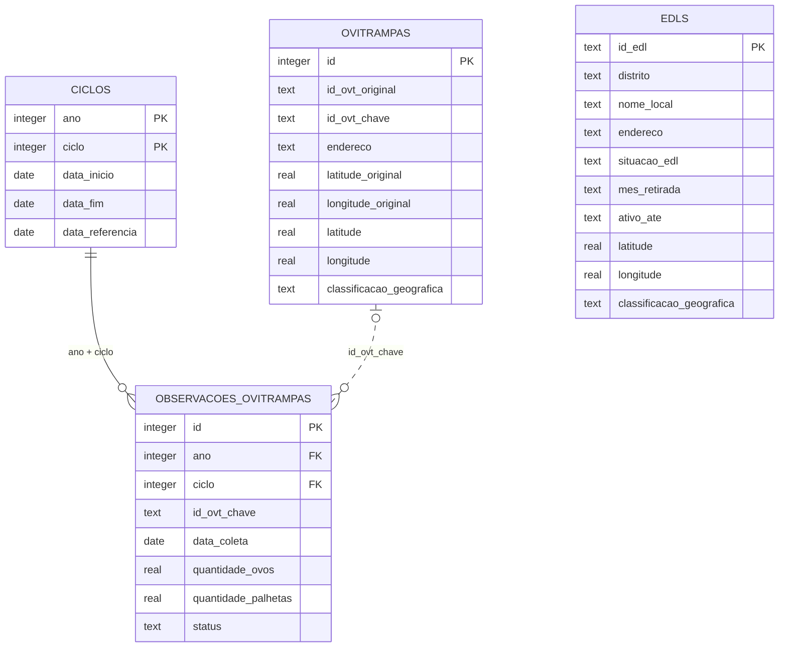

# Modelo de Dados

O banco SQLite é recriado a cada execução do pipeline. As tabelas tratadas
preservam os valores originais, os valores corrigidos e a origem dos registros.

## Grão e Chaves

| Tabela | Grão | Chave |
| --- | --- | --- |
| `edls` | um local com EDL | `id_edl` |
| `ovitrampas` | uma ovitrampa do cadastro georreferenciado disponível | `id` (`id_ovt_chave` é chave de negócio) |
| `ciclos` | um ano e ciclo | `(ano, ciclo)` |
| `observacoes_ovitrampas` | uma observação por ovitrampa e ciclo | `id` |

## ERD

## Relacionamentos

- `ciclos` e `observacoes_ovitrampas` possuem uma chave estrangeira real em
  `(ano, ciclo)`.
- `ovitrampas` e `observacoes_ovitrampas` se relacionam logicamente por
  `id_ovt_chave`. Não há chave estrangeira obrigatória porque o cadastro
  georreferenciado disponível é de 2026, enquanto as observações incluem
  histórico de 2024 e 2025.
- `edls` é uma entidade independente neste módulo.
- `edls` preserva locais reais retirados, com `situacao_edl`, `mes_retirada` e
  `ativo_ate`. Linhas de total e marcadores de retirada sem local são apenas
  registrados na auditoria de registros e não entram na tabela.
- As auditorias são arquivos CSV externos ao modelo principal e mantêm a
  rastreabilidade das correções, decisões e revisões.

## Regras de Qualidade

- Coordenadas originais nunca são sobrescritas.
- Coordenadas são tratadas somente quando a correção é segura.
- Pontos fora do Recife até 1 km são mantidos e encaminhados para revisão.
- Pontos sem coordenada ou fora do Recife a mais de 1 km podem ser
  geocodificados por endereço.
- Geocodificação preserva a fonte original e registra a fonte tratada.
- O endereço original é preservado; quando houver número, ele permanece nas
  consultas. Complementos podem ser removidos somente em tentativas
  alternativas.
- Para todo candidato à geocodificação, o endereço informado é consultado
  primeiro. Se não houver resultado, o nome do estabelecimento pode ser usado
  como fallback; `data/processados/nomes_locais_edl.csv` é apenas o inventário
  dos nomes extraídos dos EDLs. O número original permanece nas consultas de
  endereço.
- O inventário externo `data/processados/inventario_geocodificacao.csv`
  registra logradouro, número, complemento, consultas, resultado e motivo de
  revisão dos candidatos.
- `regra_coordenada` e `status_geocodificacao` são independentes. Uma consulta
  sem resultado não apaga a coordenada tratada da planilha.
- Cada tentativa de geocodificação registra explicitamente sucesso, ausência de
  endereço, ausência de resultado ou erro de consulta.
- IDs originais são preservados; `id_ovt_chave` é a chave normalizada usada na
  reconciliação entre cadastro e observações.
- Datas corrigidas ou inferidas são registradas em `auditoria_datas.csv`.
- Linhas estruturais excluídas são registradas em `auditoria_registros.csv`.
- Linhas de localização sem identificador e sem dados de localização não entram
  em `ovitrampas` nem na geocodificação; a exclusão é registrada em
  `auditoria_registros.csv`.
